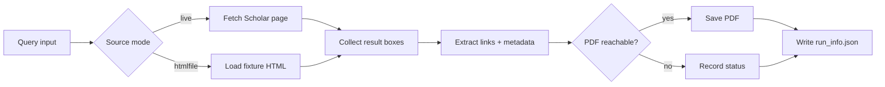

# Battery Paper Crawler

<p align="left">
  
  
  
  
</p>

Targeted Scholar-based literature harvesting for battery/electrochemistry research, with reproducible logs and PDF-first collection.

---

## Why this repo exists

This tool supports recurring literature updates without turning the workflow into a black box:

- query Scholar with controlled keywords
- extract metadata and PDF candidates
- save reachable PDFs
- record run provenance for monthly/quarterly review

It is intentionally designed for **small, auditable collection runs**.

## What it does well

| Capability | Implementation |
|---|---|
| Query execution | `crawler.py` CLI |
| HTML robustness | Multi-branch fallback parsing (`classic`, `direct_ri`, `data_rp`, `archive_old`) |
| Reproducibility | `run_info.json` with source mode, links, statuses, and timestamp |
| Offline debugging | `--htmlfile` mode using saved fixtures |
| Archive workflow | Query-scoped output folders + historical trail in `archive/` and `papers/` |

## Repository layout

```text
.
├── crawler.py                 # CLI entrypoint
├── scholar_helpers.py         # parser and extraction utilities
├── requirements.txt
├── fixtures/                  # saved Scholar HTML and link fixtures
├── archive/                   # monthly run trail + paper library snapshots
├── papers/                    # quarterly and final review writeups
├── run_monthly.bat            # minimal scheduled runner (Windows)
└── notes.txt                  # operational notes and history
```

## Quickstart

```bash
python3 -m pip install -r requirements.txt
python3 crawler.py "zinc ion battery machine learning" --limit 2
```

## Usage patterns

### Live run

```bash
python3 crawler.py "zinc ion battery machine learning" --limit 2
```

### Offline fixture run (recommended while tuning parser logic)

```bash
python3 crawler.py "zinc ion battery machine learning" \
  --limit 2 \
  --htmlfile fixtures/znion_query_page.html
```

### Custom output root

```bash
python3 crawler.py "zinc ion battery machine learning" \
  --limit 2 \
  --out-root /tmp/battery-crawler-downloads
```

### Monthly run (Windows)

```bat
run_monthly.bat
```

## Run artifact schema

Per query, the crawler writes:

1. `<out-root>/<slug-query>/search_page.html` (live mode)
2. `<out-root>/<slug-query>/*.pdf`
3. `<out-root>/<slug-query>/run_info.json`

`run_info.json` includes:

- `query`
- `source_type` (`live` or `htmlfile`)
- `source_value` (URL or fixture path)
- `saved_files`
- `results_seen` (`title`, `main_link`, `pdf_link`, `meta`, `snippet`, `save_status`)
- `run_time`

## Workflow sketch



## Known limitations

- Scholar HTML structure changes frequently; parser fallbacks are maintenance-heavy by design.
- Archived pages and live pages can differ significantly.
- Success rate depends on direct PDF availability in result cards.
- Non-PDF links and blocked/unreachable pages are expected in real runs.

## Responsible use

- Keep request rates conservative.
- Use fixture mode for debugging whenever possible.
- Treat this as a research assistant utility, not a bulk scraping system.
